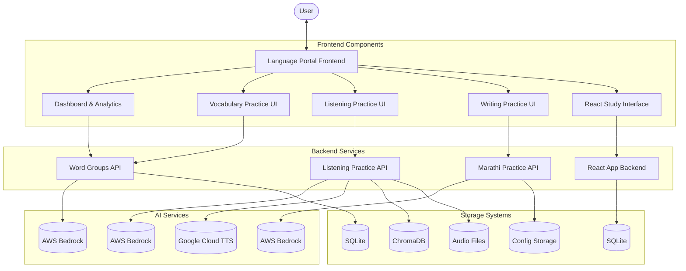

# Marathi Language Learning Portal

A comprehensive multi-service language learning platform designed specifically for Marathi learners. This application integrates multiple specialized components to provide a complete language learning experience through vocabulary practice, listening comprehension, writing exercises, and interactive study tools.

## Architecture Overview

The system consists of several interconnected services, each handling a specific aspect of language learning:



## Services

### 1. [Word Groups API](./README.md#2)
A Flask-based backend service that provides word groups and their translations in Marathi.
- Checks local SQLite database for words
- Falls back to Amazon Bedrock LLM when needed
- RESTful API for retrieving words by group ID or name

### 2. [Marathi Practice App](./README.md#1)
An interactive application for writing practice and sentence generation.
- Word selection from different categories
- Sentence generation with Marathi and English translations
- Translation practice with text input, drawing, or image upload
- Grading and feedback system
- Integration with Amazon Bedrock for language processing

### 3. [Marathi Listening Practice](./README.md#3)
A comprehensive application for practicing Marathi listening comprehension.
- Question generation via AWS Bedrock (Claude 3.5 Sonnet)
- Audio generation using Google Cloud TTS with Marathi voice models
- Practice types include dialogues and phrase matching
- Interactive feedback for answers
- Vector search using ChromaDB for context-aware generation

### 4. [Language Portal Frontend](./README.md#5)
A React-based single-page application for organizing the learning experience.
- Dashboard with statistics and study progress tracking
- Words management with extensive metadata
- Organization of words into logical groups
- Various study activity types (flashcards, quizzes, etc.)
- Study session tracking and performance analytics

### 5. [React Application Framework](./README.md#4)
A lightweight Vite-based React application framework.
- Uses Vite as build tool
- ESLint for code quality
- Clean project structure for component-based development

## AI/ML Integration

### Amazon Bedrock Integration
The platform leverages Amazon Bedrock for advanced language processing capabilities across multiple services:

1. **Word Groups API**: Uses Claude model to generate Marathi word translations when not found in the database.
2. **Marathi Practice App**: Integrates with Bedrock for sentence generation and translation grading.
3. **Listening Practice**: Uses Claude 3.5 Sonnet model to generate contextually relevant practice questions.

Configuration:
```yaml
amazon_bedrock:
  api_endpoint: "https://api.amazonbedrock.com"
  api_key: "your_api_key_here"
  model_id: "anthropic.claude-3-sonnet-20240229-v1:0"
  region: "us-east-1"
```

### Google Cloud TTS Integration
The Listening Practice module uses Google Cloud Text-to-Speech for generating native-sounding Marathi audio:

- Supports both male and female Marathi voices
- Handles speaker gender assignment
- Manages audio file concatenation using ffmpeg
- Creates appropriate pauses between speech segments

## Database Structure

The platform uses multiple database systems:

1. **SQLite Databases**:
   - Word Groups API: Stores words, translations, and group metadata
   - Language Portal: Stores user progress, study sessions, and activity data

2. **Vector Store (ChromaDB)**:
   - Used by the Listening Practice module for semantic search
   - Enables finding similar questions for context-aware generation

3. **File Storage**:
   - Audio files from the Listening Practice module
   - Configuration files across services

## Installation

Each service has its own installation instructions. Please refer to the individual service READMEs for detailed setup steps:

- [Word Groups API Setup](./README.md#2)
- [Marathi Practice App Setup](./README.md#1)
- [Marathi Listening Practice Setup](./README.md#3)
- [Language Portal Frontend Setup](./README.md#5)
- [React Application Framework Setup](./README.md#4)

## Usage

After installing all services, you can access the main Language Portal Frontend which provides navigation to all other modules. The typical user journey includes:

1. Selecting words to study from the Word Groups interface
2. Practicing writing and translation with the Marathi Practice App
3. Developing listening skills with the Listening Practice module
4. Tracking progress and managing study sessions via the Dashboard

## Development

### Prerequisites
- Python 3.8+ (for backend services)
- Node.js 14+ (for frontend applications)
- AWS account with Bedrock access
- Google Cloud account with Text-to-Speech API enabled
- ffmpeg (for audio processing)

### Running the Development Environment
Follow the setup instructions for each individual service and run them simultaneously.

## Future Extensions

The modular architecture allows for easy addition of new language learning features, such as:
- Speech recognition and pronunciation practice
- Grammar exercises and explanations
- Cultural context and language immersion activities
- Mobile application support
- Multi-language support beyond Marathi

## License

This project is licensed under the MIT License. See the LICENSE file in each service for details.

---

For specific setup instructions and more detailed information about each service, please refer to their individual README files linked throughout this document.