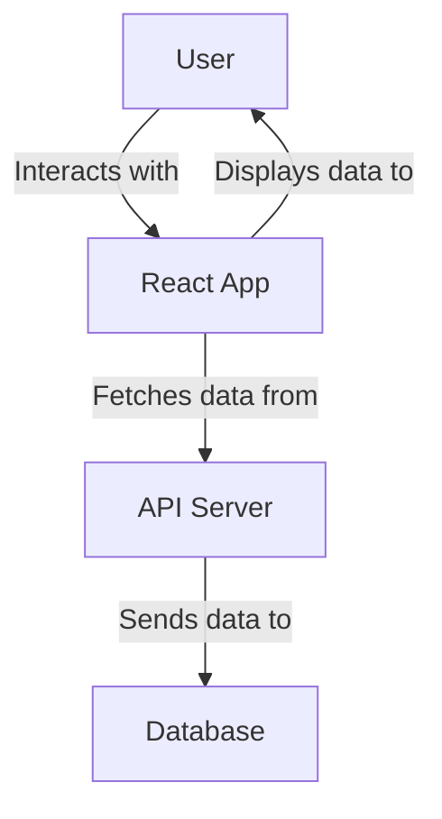

## Project Overview

This project is designed to help you get started with a React application using Vite as the build tool. It includes configurations for ESLint to ensure code quality and consistency.

## Getting Started

### Prerequisites

Make sure you have the following installed:

- Node.js (>= 14.x)
- npm (>= 6.x) or yarn (>= 1.x)

### Installation

1. Clone the repository:
    ```sh
    git clone https://github.com/sudhanvapaturkar/free-genai-bootcamp-2025.git
    cd free-genai-bootcamp-2025/lang-importer
    ```

2. Install dependencies:
    ```sh
    npm install
    # or
    yarn install
    ```

### Running the Development Server

To start the development server with hot module replacement:
```sh
npm run dev
# or
yarn dev
```

### Building for Production

To create a production build:
```sh
npm run build
# or
yarn build
```

### Linting

To run ESLint:
```sh
npm run lint
# or
yarn lint
```

## Project Structure

```
/lang-importer
├── public          # Static assets
├── src             # Source code
│   ├── assets      # Assets like images, styles, etc.
│   ├── components  # React components
│   ├── App.jsx     # Main App component
│   └── main.jsx    # Entry point
├── .eslintrc.js    # ESLint configuration
├── vite.config.js  # Vite configuration
└── package.json    # Project metadata and dependencies
```

## Configuration

### Vite Configuration

The Vite configuration file (`vite.config.js`) includes settings for the development server, build options, and plugins. You can customize it according to your project's requirements.

### ESLint Configuration

The ESLint configuration file (`.eslintrc.js`) defines the linting rules for the project. It is set up to work with React and includes recommended rules for code quality and consistency.

## Usage Examples

### Adding a New Component

To add a new component, create a new file in the `src/components` directory. For example, to create a `HelloWorld` component:

```jsx
// src/components/HelloWorld.jsx
import React from 'react';

const HelloWorld = () => {
    return <h1>Hello, World!</h1>;
};

export default HelloWorld;
```

Then, import and use the component in your `App.jsx`:

```jsx
// src/App.jsx
import React from 'react';
import HelloWorld from './components/HelloWorld';

function App() {
    return (
        <div className="App">
            <HelloWorld />
        </div>
    );
}

export default App;
```

## Technical Diagram



## Contributing

Contributions are welcome! Please open an issue or submit a pull request.

## License

This project is licensed under the MIT License.
