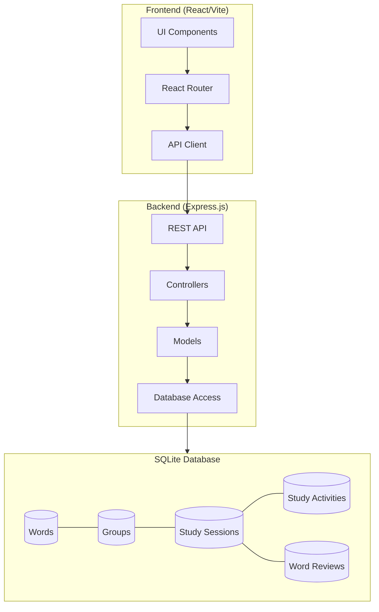

# Language Learning Portal

A comprehensive web application designed to facilitate language learning through structured vocabulary study activities. This platform allows users to organize words into groups, track study progress, and engage with various learning activities.

## Architecture Overview


The Language Learning Portal follows a client-server architecture:

- **Frontend**: React-based SPA using Vite, React Router, and TanStack Query
- **Backend**: Express.js RESTful API with SQLite database
- **Database**: SQLite with tables for words, groups, study activities, study sessions, and word reviews


## Features

- Dashboard with statistics and study progress tracking
- Words management with extensive metadata
- Organization of words into logical groups
- Various study activity types (flashcards, quizzes, etc.)
- Study session tracking and performance analytics
- Settings for system configuration and resets

## Project Structure

```
language-learning-portal/
├── lang-portal-backend/       # Express.js backend
│   ├── src/
│   │   ├── controllers/       # API endpoint handlers
│   │   ├── models/            # Database models
│   │   ├── routes/            # API route definitions
│   │   ├── migrations/        # Database schema migrations
│   │   ├── seeds/             # Seed data
│   │   ├── app.js             # Express application setup
│   │   └── database.js        # Database connection
│   ├── sql/                   # SQL scripts
│   ├── package.json           # Backend dependencies
│   └── words.db               # SQLite database
│
└── lang-portal-frontend/      # React frontend
    ├── src/
    │   ├── components/        # Reusable UI components
    │   ├── pages/             # Page components
    │   ├── App.tsx            # Main application component
    │   └── index.css          # Global styles
    ├── public/                # Static assets
    ├── package.json           # Frontend dependencies
    └── vite.config.ts         # Vite configuration
```

## Backend Data Models

- **Word**: Vocabulary items with translations, examples, etc.
- **Group**: Logical groupings of words (e.g., by theme, difficulty)
- **StudyActivity**: Different learning activities (flashcards, quizzes)
- **StudySession**: Records of study events with user performance
- **WordReviewItem**: Individual word review instances within sessions

## Getting Started

### Prerequisites

- Node.js (v16+)
- npm or Bun package manager

### Backend Setup

1. Navigate to the backend directory:
   ```bash
   cd lang-portal-backend
   ```

2. Install dependencies:
   ```bash
   npm install
   ```

3. Create a `.env` file in the root of the backend directory with the following content:
   ```
   PORT=3000
   NODE_ENV=development
   ```

4. Initialize the database:
   ```bash
   npm run db:init
   ```

5. Start the backend server:
   ```bash
   npm run dev
   ```

### Frontend Setup

1. Navigate to the frontend directory:
   ```bash
   cd lang-portal-frontend
   ```

2. Install dependencies:
   ```bash
   npm install
   # OR if using Bun
   bun install
   ```

3. Create a `.env` file in the root of the frontend directory:
   ```
   VITE_API_URL=http://localhost:3000/api
   ```

4. Start the development server:
   ```bash
   npm run dev
   # OR if using Bun
   bun run dev
   ```

5. Access the application at `http://localhost:5173`

## API Endpoints

### Dashboard
- `GET /api/dashboard/last-study-session` - Get the most recent study session
- `GET /api/dashboard/study-progress` - Get overall study progress statistics
- `GET /api/dashboard/quick-stats` - Get summary statistics for the dashboard

### Words
- `GET /api/words` - List all words (paginated)
- `GET /api/words/:id` - Get a specific word by ID

### Groups
- `GET /api/groups` - List all word groups (paginated)
- `GET /api/groups/:id` - Get a specific group by ID
- `GET /api/groups/:id/words` - Get all words in a specific group
- `GET /api/groups/:id/study_sessions` - Get study sessions for a group

### Study Activities
- `GET /api/study_activities` - List all study activities (paginated)
- `GET /api/study_activities/:id` - Get a specific study activity
- `GET /api/study_activities/:id/study_sessions` - Get sessions for an activity
- `POST /api/study_activities/:id?group_id=X` - Create a new study session

### Study Sessions
- `GET /api/study_sessions` - List all study sessions (paginated)
- `GET /api/study_sessions/:id` - Get a specific study session
- `GET /api/study_sessions/:id/words` - Get words reviewed in a session
- `POST /api/study_sessions/:id/words/:word_id/review` - Record a word review

### Settings
- `POST /api/reset-history` - Reset all study history
- `POST /api/full-reset` - Full system reset (deletes all data)

## Development

### Database Migrations

When modifying the database schema:

1. Create a new migration file in `lang-portal-backend/src/migrations/`
2. Run migrations using:
   ```bash
   npm run db:migrate
   ```

### Adding Seed Data

1. Add seed data JSON files to `lang-portal-backend/src/seeds/`
2. Run the seed command:
   ```bash
   npm run db:seed
   ```

### Running Tests

Backend tests:
```bash
cd lang-portal-backend
npm test
```

Frontend tests:
```bash
cd lang-portal-frontend
npm test
```

## Deployment

### Backend

1. Build the backend:
   ```bash
   cd lang-portal-backend
   npm run build
   ```

2. Deploy the compiled code to your server

3. Set environment variables on your server:
   ```
   PORT=3000
   NODE_ENV=production
   ```

### Frontend

1. Build the frontend:
   ```bash
   cd lang-portal-frontend
   npm run build
   ```

2. Deploy the contents of the `dist` directory to your static file server

3. Configure your server to serve the `index.html` for all routes to support client-side routing

## Technologies Used

### Backend
- Node.js
- Express.js
- SQLite
- Jest (testing)

### Frontend
- React
- TypeScript
- Vite
- TanStack Query (React Query)
- React Router
- Tailwind CSS
- shadcn/ui components

## Contributing

1. Fork the repository
2. Create a feature branch (`git checkout -b feature/amazing-feature`)
3. Commit your changes (`git commit -m 'Add some amazing feature'`)
4. Push to the branch (`git push origin feature/amazing-feature`)
5. Open a Pull Request

## License

This project is licensed under the MIT License.