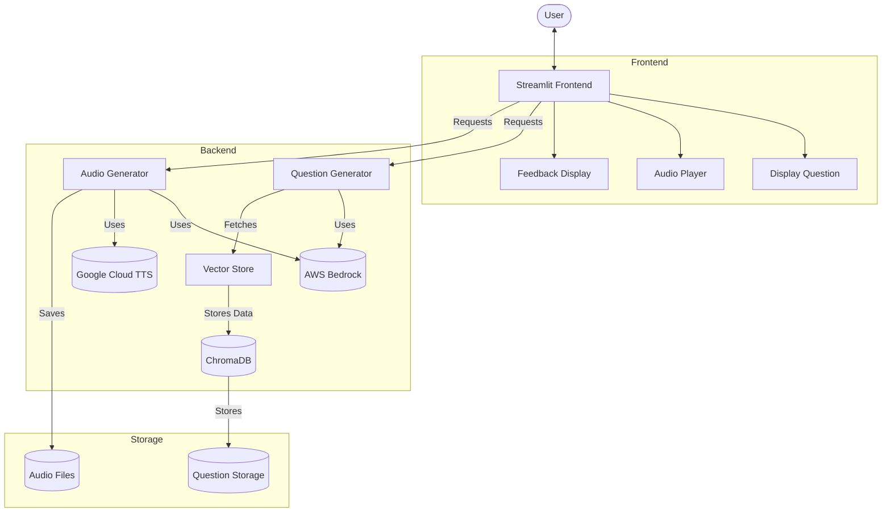

# Marathi Listening Practice Application

A comprehensive application designed to help users practice and improve their Marathi language listening comprehension skills. The application generates various practice scenarios, delivers audio content with appropriate voices, and provides interactive feedback.


## Architecture Overview



## Features

- **Question Generation**: Creates contextually relevant Marathi language practice questions
- **Audio Generation**: Produces native-sounding Marathi audio with appropriate male/female voices
- **Practice Types**: 
  - Dialogue Practice: Conversational scenarios with comprehension questions
  - Phrase Matching: Situational phrase selection scenarios
- **Interactive Feedback**: Provides explanations for correct/incorrect answers
- **Persistence**: Stores generated questions and audio for future use
- **Vector Search**: Finds similar questions for context-aware generation

## Technical Components

1. **Frontend**: Streamlit-based UI
2. **Backend**:
   - Question Generator: AWS Bedrock (Claude 3.5 Sonnet) for NLG
   - Audio Generator: Google Cloud TTS with Marathi voice models
   - Vector Store: ChromaDB for semantic search functionality
3. **Infrastructure**: 
   - AWS services for AI/ML
   - Google Cloud for speech synthesis
   - Local file storage for persistence

## Prerequisites

- Python 3.9+
- ffmpeg (for audio processing)
- AWS account with Bedrock access
- Google Cloud account with Text-to-Speech API enabled
- Required Python packages (see requirements.txt)

## Setup Instructions

### 1. Clone Repository and Create Virtual Environment

```bash
git clone https://github.com/yourusername/marathi-listening-practice.git
cd marathi-listening-practice
python -m venv venv
source venv/bin/activate  # On Windows: venv\Scripts\activate
pip install -r requirements.txt
```

### 2. AWS Configuration

1. Create an AWS account if you don't have one
2. Request access to AWS Bedrock and Claude 3.5 Sonnet model
3. Configure AWS credentials:

```bash
aws configure
```

Or manually create `~/.aws/credentials` file:

```
[default]
aws_access_key_id = YOUR_ACCESS_KEY
aws_secret_access_key = YOUR_SECRET_KEY
region = us-east-1
```

4. Verify Bedrock access:

```bash
aws bedrock list-foundation-models --region us-east-1
```

### 3. Google Cloud Configuration

1. Create a Google Cloud account 
2. Create a new project
3. Enable Text-to-Speech API
4. Create service account credentials:
   - Go to Google Cloud Console → IAM & Admin → Service Accounts
   - Create a new service account
   - Grant "Cloud Text-to-Speech User" role
   - Create a JSON key and download it

5. Set environment variable to point to your credentials:

```bash
export GOOGLE_APPLICATION_CREDENTIALS="/path/to/your-project-credentials.json"
```

On Windows:
```
set GOOGLE_APPLICATION_CREDENTIALS=C:\path\to\your-project-credentials.json
```

### 4. Directory Setup

Run the setup script to create the necessary directory structure:

```bash
python setup.py
```

This creates:
- `backend/data/vectorstore/`: For ChromaDB vector storage
- `backend/data/stored_questions/`: For question persistence
- `backend/data/stored_questions.json`: Question metadata
- `frontend/static/audio/`: For generated audio files

### 5. Run the Application

```bash
streamlit run frontend/main.py
```

The application will be available at http://localhost:8501 by default.

## Component Details

### Question Generator

The `QuestionGenerator` class handles the creation of practice scenarios using AWS Bedrock:

- Uses Claude 3.5 Sonnet model via AWS Bedrock API
- Generates contextually relevant questions based on selected topics
- Provides feedback on user answers
- Interfaces with Vector Store for semantic search

Configuration: Adjust model parameters in `question_generator.py`

### Audio Generator

The `AudioGenerator` class manages the text-to-speech conversion:

- Uses Google Cloud Text-to-Speech for Marathi voices
- Handles speaker gender assignment (male/female)
- Manages audio file concatenation using ffmpeg
- Creates appropriate pauses between speech segments

Configuration: Adjust voice settings in `audio_generator.py`

### Vector Store

The `QuestionVectorStore` class provides semantic search capabilities:

- Uses ChromaDB for vector storage
- Enables finding similar questions for context-aware generation
- Persists embeddings for future use

Configuration: Adjust search parameters in `vector_store.py`

### Frontend

The Streamlit interface provides:

- Topic and practice type selection
- Question display and audio playback
- Answer submission and feedback
- History of previously generated questions

## Troubleshooting

### Audio Generation Issues

1. Verify ffmpeg installation: `ffmpeg -version`
2. Check Google Cloud credentials are correctly set
3. Inspect logs for specific TTS errors
4. Verify Marathi voice models are available in your GCP region

### Question Generation Issues

1. Verify AWS credentials and Bedrock access
2. Check model availability: `aws bedrock list-foundation-models`
3. Inspect response format from Claude model
4. Check for rate limiting or quota issues

### Vector Store Issues

1. Verify ChromaDB installation
2. Check data directory permissions
3. Clear `backend/data/vectorstore` directory if corruption occurs

## Development and Extension

### Adding New Practice Types

Modify `frontend/main.py` to include new practice types in the selection dropdown, then update `question_generator.py` to handle the new type.

### Supporting Additional Languages

1. Update voice configurations in `audio_generator.py`
2. Modify prompts in `question_generator.py`
3. Update UI labels in `frontend/main.py`

### Custom Voice Models

To use custom voice models:

1. Train custom voice in Google Cloud TTS Studio
2. Update voice configuration in `audio_generator.py`:

```python
self.voices = {
    'male': {'name': 'your-custom-male-voice', 'gender': texttospeech.SsmlVoiceGender.MALE},
    'female': {'name': 'your-custom-female-voice', 'gender': texttospeech.SsmlVoiceGender.FEMALE},
}
```

## License

This project is licensed under the MIT License.
