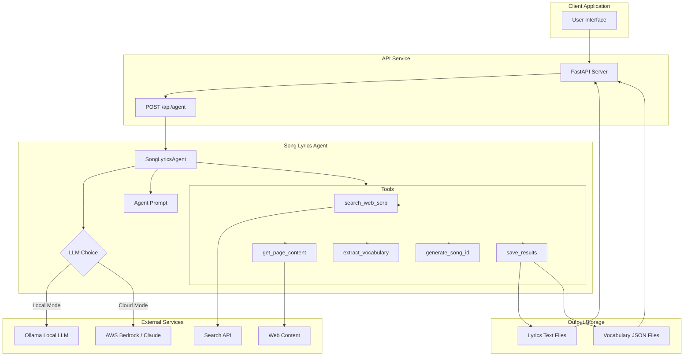

# Marathi Song Vocabulary Agent

A specialized application that finds Marathi song lyrics, extracts vocabulary, and creates learning resources for language learners.

## Overview

This application helps users learn Marathi vocabulary through song lyrics. It:
1. Searches for and retrieves Marathi song lyrics from the web
2. Extracts vocabulary from the lyrics
3. Provides detailed vocabulary breakdowns with phonetic transcriptions and English meanings
4. Saves structured data for language learning use

The system employs a ReAct (Reasoning + Acting) agent architecture, using an LLM (Large Language Model) to coordinate the process and specialized tools to handle specific tasks.

## Architecture


The application is built with a modular architecture:

- **FastAPI Backend**: Handles HTTP requests and orchestrates the agent
- **SongLyricsAgent**: Manages the LLM and coordinates tools
- **Tool Registry**: Collection of specialized tools for different tasks
- **LLM Options**: Flexible integration with local Ollama models or cloud-based AWS Bedrock models

## Technical Components

### Core Technologies

- **Python 3.8+**: Core programming language
- **FastAPI**: API framework for handling HTTP requests
- **Ollama**: For local LLM inference
- **AWS Bedrock**: For cloud-based LLM inference (Claude models)
- **Pydantic**: Data validation and settings management
- **ReAct**: (Reasoning and Acting) agent architecture

### LLM Models

The system supports two options for the LLM backend:

1. **Local Model** (Ollama):
   - Default model: `mistral`
   - Configurable via environment variable: `LOCAL_MODEL`
   - Context window calculated based on available RAM

2. **Cloud Model** (AWS Bedrock):
   - Default model: `anthropic.claude-3-5-sonnet-20240620-v1:0`
   - Configurable via environment variable: `CLOUD_MODEL`
   - Enabled by setting `USE_CLOUD_AGENT=true`

### Tool System

The agent uses a collection of specialized tools:

1. **`search_web_serp`**: Searches for lyrics using a SERP API
2. **`get_page_content`**: Extracts content from a web page
3. **`extract_vocabulary`**: Analyzes Marathi text and extracts vocabulary with detailed information
4. **`generate_song_id`**: Creates a URL-safe song ID from artist and title
5. **`save_results`**: Stores lyrics and vocabulary to the file system

### ReAct Architecture

The application implements a ReAct (Reasoning + Acting) architecture where:

1. The LLM receives a prompt that defines the task and available tools
2. The LLM reasons about which tool to use next based on the current state
3. The system executes the tool and returns the result to the LLM
4. This cycle repeats until the task is complete

### Output Format

The system produces two files for each song:

1. **Lyrics File**: Plain text file containing the Marathi lyrics
   - Stored at: `outputs/lyrics/{song_id}.txt`

2. **Vocabulary File**: JSON file with detailed vocabulary breakdown
   - Stored at: `outputs/vocabulary/{song_id}.json`
   - Format:
   ```json
   [
     {
       "marathi": "पैसे देणे",
       "phonetic": "Paisē dēṇē",
       "english": "to pay",
       "parts": [
         { "marathi": "पैसे", "phonetic": ["Paisē"] },
         { "marathi": "देणे", "phonetic": ["dēṇē"] }
       ]
     },
     ...
   ]
   ```

## Setup and Requirements

### Requirements

- Python 3.8+
- For local mode:
  - Ollama installed and running
  - Sufficient RAM for the LLM context window
- For cloud mode:
  - AWS credentials configured
  - Appropriate permissions for Bedrock

### Environment Variables

| Variable | Description | Default | Required |
|----------|-------------|---------|----------|
| `USE_CLOUD_AGENT` | Use AWS Bedrock instead of local Ollama | `false` | No |
| `LOCAL_MODEL` | Ollama model to use | `mistral` | No |
| `CLOUD_MODEL` | AWS Bedrock model to use | `anthropic.claude-3-5-sonnet-20240620-v1:0` | No |

### Installation

1. Clone the repository
   ```bash
   git clone https://github.com/your-username/marathi-song-vocabulary.git
   cd marathi-song-vocabulary
   ```

2. Create a virtual environment
   ```bash
   python -m venv venv
   source venv/bin/activate  # On Windows: venv\Scripts\activate
   ```

3. Install dependencies
   ```bash
   pip install -r requirements.txt
   ```

4. Configure environment variables
   ```bash
   # For local mode with Ollama
   export USE_CLOUD_AGENT=false
   export LOCAL_MODEL=mistral
   
   # Or for cloud mode with AWS Bedrock
   export USE_CLOUD_AGENT=true
   export CLOUD_MODEL=anthropic.claude-3-5-sonnet-20240620-v1:0
   # Make sure AWS credentials are configured
   ```

5. Run the application
   ```bash
   uvicorn app:app --host 0.0.0.0 --port 8000
   ```

## Usage

### API Endpoint

The application provides a single API endpoint:

```
POST /api/agent
```

Body format:
```json
{
  "message_request": "Find lyrics for the song तू माझा संगाती by Ajay-Atul"
}
```

Response format:
```json
{
  "song_id": "ajay-atul-tu-mazha-sangaati",
  "lyrics": "तू माझा संगाती\nमला देशी साथ...",
  "vocabulary": [
    {
      "marathi": "तू",
      "phonetic": "tū",
      "english": "you",
      "parts": [{"marathi": "तू", "phonetic": ["tū"]}]
    },
    ...
  ]
}
```

### Example Request

```bash
curl -X POST "http://localhost:8000/api/agent" \
     -H "Content-Type: application/json" \
     -d '{"message_request": "Find lyrics for the song तू माझा संगाती by Ajay-Atul"}'
```

## Implementation Details

### Fault Tolerance

The system includes multiple fallback mechanisms:

1. **Tool Error Recovery**: Attempts to recover from errors in tool execution
2. **LLM Output Parsing**: Robust parsing of LLM responses to handle variations in output format
3. **State Tracking**: Keeps track of intermediate results to allow for recovery
4. **Auto-saving**: Ensures outputs are saved even if some steps fail

### Context Window Management

The system includes a dynamic context window calculator based on available RAM:

```python
def calculate_safe_context_window(available_ram_gb: float, safety_factor: float = 0.8) -> int:
    """
    Calculate a safe context window size based on available RAM.
    """
    GB_PER_128K_TOKENS = 58.0
    TOKENS_128K = 131072
    tokens_per_gb = TOKENS_128K / GB_PER_128K_TOKENS
    safe_tokens = math.floor(available_ram_gb * tokens_per_gb * safety_factor)
    power_of_2 = 2 ** math.floor(math.log2(safe_tokens))
    final_tokens = min(power_of_2, TOKENS_128K)
    return final_tokens
```

### Logging

The application uses Python's logging module for comprehensive logging:

- **Debug level**: Detailed debugging information
- **Info level**: General operational information
- **Warning level**: Issues that might lead to problems
- **Error level**: Errors that affect operation but don't crash the application

## Extension Points

The application can be extended in several ways:

1. **New Tools**: Add new tools to the `ToolRegistry` to support additional capabilities
2. **Different LLMs**: Configure different Ollama or Bedrock models
3. **Enhanced Vocabulary**: Extend the vocabulary extraction to include additional details

## License

This project is licensed under the MIT License.