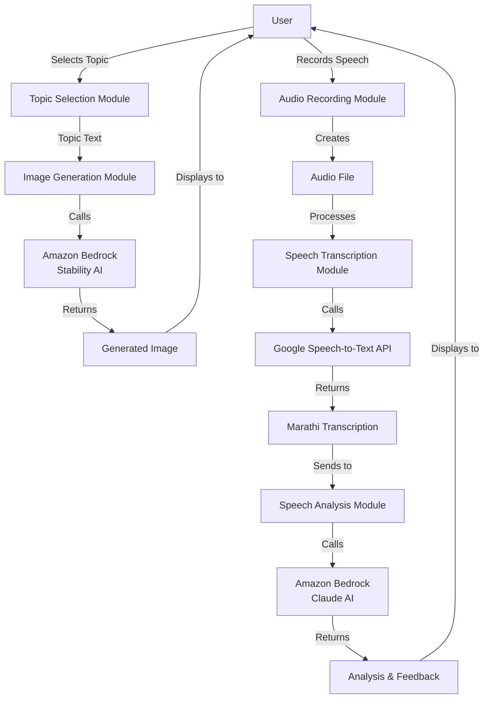

# Marathi Speaking Practice App

This project is a Marathi Speaking Practice App designed to help users improve their Marathi speaking skills through AI-powered feedback. The app allows users to select topics, generates relevant images, records their spoken Marathi, transcribes it, and provides detailed feedback on their speaking performance.

| [](https://youtu.be/jwW-c-SOA3s) | 
|:--:| 
| *Click on the gif to view the entire demo on youtube.* |

## Features

- **Topic Selection**: Users can enter a topic they want to speak about in Marathi.
- **AI-Generated Images**: The app generates topic-related images using Stability AI to provide visual context.
- **Audio Recording**: Users can record themselves speaking Marathi for up to 30 seconds.
- **Speech Transcription**: The app transcribes Marathi speech using Google Speech-to-Text API.
- **AI-Powered Analysis**: Claude AI analyzes the transcription and provides detailed feedback on grammar, relevance, vocabulary, and fluency.
- **Grading System**: Speaking performance is graded on a 40-point scale with corresponding letter grades.
- **Practice Suggestions**: The app provides suggested practice phrases in both Marathi and English.

## Installation

1. Clone the repository:
   ```sh
   git clone https://github.com/yourusername/marathi-speaking-practice.git
   cd marathi-speaking-practice
   ```

2. Create a virtual environment and activate it:
   ```sh
   python3 -m venv venv
   source venv/bin/activate   # On Windows: venv\Scripts\activate
   ```

3. Install the required dependencies:
   ```sh
   pip install -r requirements.txt
   ```

## Configuration

### AWS Bedrock Configuration

To use Amazon Bedrock for AI image generation and analysis:

1. Set up your AWS account and configure your credentials:
   ```sh
   aws configure
   ```

2. Ensure your AWS user has appropriate permissions for Amazon Bedrock services.

3. Update the AWS region in the app's sidebar if needed (default is 'us-east-1').

### Google Cloud Configuration

To use Google Speech-to-Text API for transcription:

1. Create a Google Cloud project and enable the Speech-to-Text API.

2. Create a service account and download the JSON credentials file.

3. Set the environment variable to point to your credentials file:
   ```sh
   export GOOGLE_APPLICATION_CREDENTIALS="/path/to/your-credentials.json"
   ```

## Usage

Run the app using Streamlit:
```sh
streamlit run main.py
```

The app will guide you through a 4-step process:

1. **Choose a Topic**: Enter a topic you want to speak about in Marathi (3-4 words maximum).
2. **Speak about the Image**: Look at the generated image and record yourself speaking in Marathi.
3. **Review Your Speaking**: Listen to your recording and proceed to get feedback.
4. **Your Speaking Feedback**: View the transcription and detailed analysis of your speaking skills.

## Project Structure

- `main.py`: Main application file containing the Streamlit app logic.
- `requirements.txt`: List of required Python packages.
- `temp/`: Directory for temporary files (recordings, images).

## Technical Architecture

Below is a high-level technical diagram of the Marathi Speaking Practice App:



## Dependencies

- **AWS Services**:
  - Amazon Bedrock (for Claude AI and Stability AI)
- **Google Cloud Services**:
  - Google Speech-to-Text API
- **Python Libraries**:
  - Streamlit: Web application framework
  - Boto3: AWS SDK for Python
  - SoundDevice & Scipy: Audio recording and processing
  - Pillow: Image processing
  - Pydub: Audio format conversion
  - Google Cloud Speech: Speech recognition


## License

This project is licensed under the MIT License. See the LICENSE file for more details.
