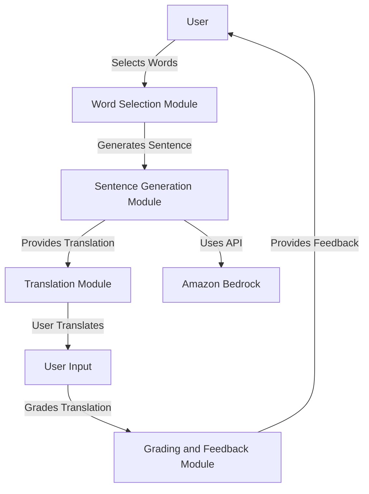

# Marathi Writing Practice App

This project is a Marathi Practice App designed to help users learn and practice Marathi language through various interactive features. The app allows users to generate sentences using selected words, translate sentences, and get feedback on their translations.


## Features

- **Word Selection**: Users can select words from different categories to generate sentences.
- **Sentence Generation**: The app generates Marathi sentences using the selected words and provides their English translations.
- **Translation Practice**: Users can practice translating English sentences to Marathi using text input, drawing on a canvas, or uploading images of handwritten text.
- **Grading and Feedback**: The app grades the user's translations and provides detailed feedback to help improve their language skills.

## Installation

1. Clone the repository:
   ```sh
   git clone https://github.com/yourusername/marathi-practice-app.git
   cd marathi-practice-app
   ```

2. Create a virtual environment and activate it:

    ```sh
    python3 -m venv venv
    source venv/bin/activate
    ```

3. Install the required dependencies:

    ```sh
    pip install -r requirements.txt
    ```

## Configuration

Configure the app by updating the config.yaml file with the necessary settings, such as API endpoints and model configurations.

### Amazon Bedrock Configuration

To integrate Amazon Bedrock for advanced language processing capabilities, follow these steps:

1. Set up your Amazon Bedrock account and obtain the necessary API keys.
2. Update the `config.yaml` file with your Amazon Bedrock API endpoint and API key:
    ```yaml
    amazon_bedrock:
      api_endpoint: "https://api.amazonbedrock.com"
      api_key: "your_api_key_here"
    ```

3. Ensure that the required permissions are set up in your AWS account to allow the app to access Amazon Bedrock services.

## Usage

Run the app using Streamlit
    ```sh
    streamlit run app.py
    ```

## Project Structure

- app.py: Main application file containing the Streamlit app logic.
- config.yaml: Configuration file for API endpoints and model settings.
- requirements.txt: List of required Python packages.
- sample.py: Sample script for logging.

## Technical Diagram

Below is a high-level technical diagram of the Marathi Practice App:



## License
This project is licensed under the MIT License. See the LICENSE file for more details.

